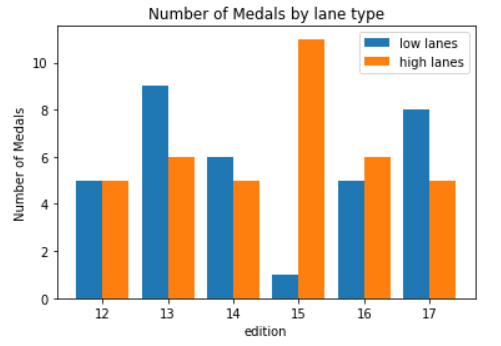
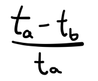
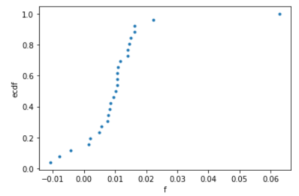

# Whirlpool effect
in this project we investigated allegations from swimmers stating that the pool used for the 2013 fina world swimming chamionship had a whirpool effect

for an in-depth analysis, open the jupyter notebook which adheres to the following structure:

1. to start off we look at the medal differencial for this comp compared to others and find that there is a difference

2. then we compare the time for swimmers who swam in a high/low lane in the semifinals and the other lane type for the final and find high lane swimmers swim faster

3. then we compute a hypothesis test using bootstrap replicates and find that the results of this competiton are not by chance, lending truth to the athletes claims

---

To tackle this question, we first have to understand what the alleged problem is. the swimmers complained of an effect that was against the current for lanes 6 through 8 and with the current for lanes 1 through 3.

we start by comparing the number of medals each lane received during recent competitions. if the pools were to be unbiased throughout there should be no visable difference in medal counts

to go about doing this, we will only considers competitions that only stretch 50 meters, ensuring each swimmer had one trip down.



we can see that there is in fact a difference for our competition in question.

now we must formulate an good metric to judge the difference between the swim times. since we are looking for a difference between lanes for all genders and strokes we will use...



this formula ensure the different strokes/genders will be accounted for along with yeilding either positive or negative number

now lets plot the ecdf for this data



we can see all but three swim faster in higher lanes
lets see the range for this metric.

```python
# Compute the mean difference: f_mean
f_mean = np.mean(candidates['f'])

# Draw 10,000 bootstrap replicates: bs_reps
bs_reps = draw_bs_reps(candidates['f'], np.mean, 10000)

# Compute 95% confidence interval: conf_int
conf_int = np.percentile(bs_reps, [2.5, 97.5])

# Print the result
print("""
mean frac. diff.: {0:.5f}
95% conf int of mean frac. diff.: [{1:.5f}, {2:.5f}]""".format(f_mean, *conf_int))
```

the mean is around 0.01051 with a 95% conf in between [0.00612, 0.01592]


now how should we test our hypothesis. to do this we take the mean of our test statistic and subtract it from the data values in it and then take bootstrap samples of it to compare how many bootstrap means are bigger than our original mean.

```python
f_shift = candidates['f'] - f_mean

# Draw 100,000 bootstrap replicates of the mean: bs_reps
bs_reps = draw_bs_reps(f_shift,np.mean, 100000)

# Compute and report the p-value
p_val = np.sum(bs_reps >= f_mean) / 100000
print('p =', p_val)
```

we get a small p value meaning our current rresult is statistically significant